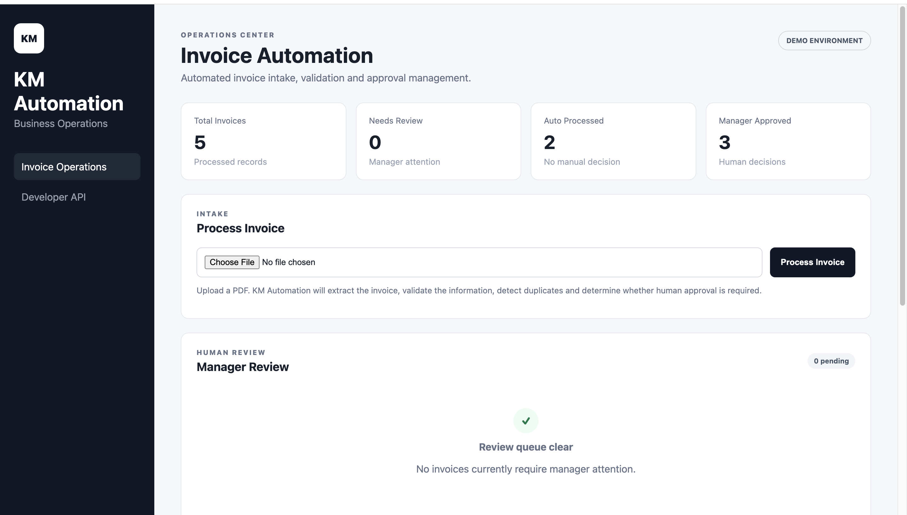
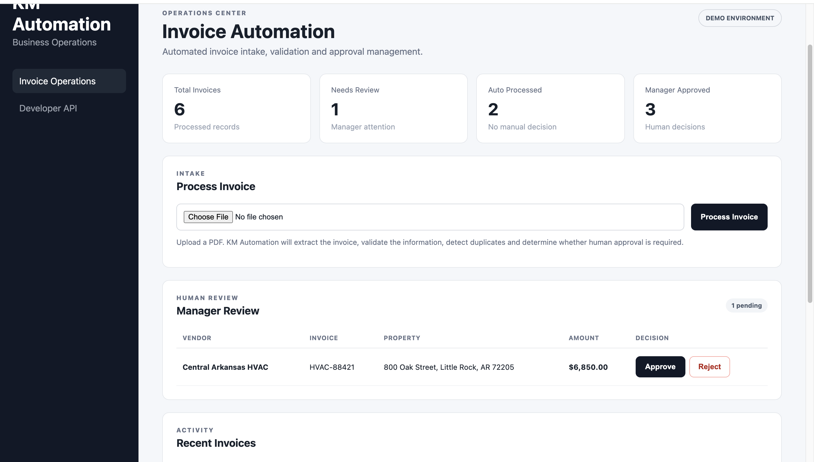

# KM Automation Lab

KM Automation Lab is a business process automation demo built to show how repetitive invoice-processing workflows can be automated while keeping human approval in the loop for higher-risk transactions.

## Screenshots



## Demo: Invoice Operations

The current demo processes PDF invoices through an automated workflow:

PDF Upload  
→ Text Extraction  
→ Structured Invoice Extraction  
→ Validation  
→ Duplicate Detection  
→ Business Rules  
→ Automatic Processing or Manager Review  
→ PostgreSQL Persistence  
→ Audit History

## Business Problem

Businesses often receive invoices that must be manually reviewed, entered into systems, checked for duplicates, and routed for approval.

KM Automation demonstrates how software can reduce this repetitive work while preserving human oversight.

## Current Features

- PDF invoice upload
- PDF text extraction
- Deterministic invoice extraction
- AI-assisted extraction fallback
- Structured data validation
- Duplicate invoice detection
- Automatic approval rules
- Manager review queue
- Manager approve/reject workflow
- PostgreSQL persistence
- Job tracking
- Audit trail
- Processing history
- Operations dashboard
- FastAPI REST API
- Interactive API documentation

## Decision Logic

Invoices at or below the configured automatic-processing threshold can proceed automatically after validation.

Invoices above the threshold are routed to the manager review queue.

The demo currently uses a $5,000 threshold.

## Hybrid Extraction

The system uses two extraction strategies.

### Deterministic Extraction

Known invoice formats are processed using predictable extraction rules.

### AI Fallback

When deterministic extraction cannot understand the document structure, the system can use an AI extraction service to interpret the invoice.

The extracted result is still validated by the application before entering the workflow.

AI does not make the final business decision.

## Human-in-the-Loop Workflow

Higher-value invoices are not automatically approved.

They enter a manager review queue where a human can approve or reject the invoice.

The decision is recorded in the audit history.

## Duplicate Protection

The system checks vendor and invoice number combinations before creating a new invoice record.

A database uniqueness constraint provides an additional layer of duplicate protection.

## Audit History

Important workflow events are recorded, including:

- Invoice received
- Text extracted
- Extraction method selected
- Validation completed
- Invoice saved
- Manager review required
- Automatic processing approved
- Manager approval/rejection
- Duplicate detection
- Processing failures

## Technology

- Python
- FastAPI
- PostgreSQL
- SQLAlchemy
- Pydantic
- PyMuPDF
- Jinja2
- Google Gemini API
- HTML/CSS
- Uvicorn

## Demo Dashboard

The dashboard provides:

- Total invoice count
- Manager-review count
- Automatically processed count
- Manager-approved count
- PDF invoice upload
- Manager review queue
- Approval/rejection controls
- Recent invoice activity
- Invoice audit history

## Running Locally

Create and activate a Python virtual environment.

```bash
python3 -m venv .venv
source .venv/bin/activate
